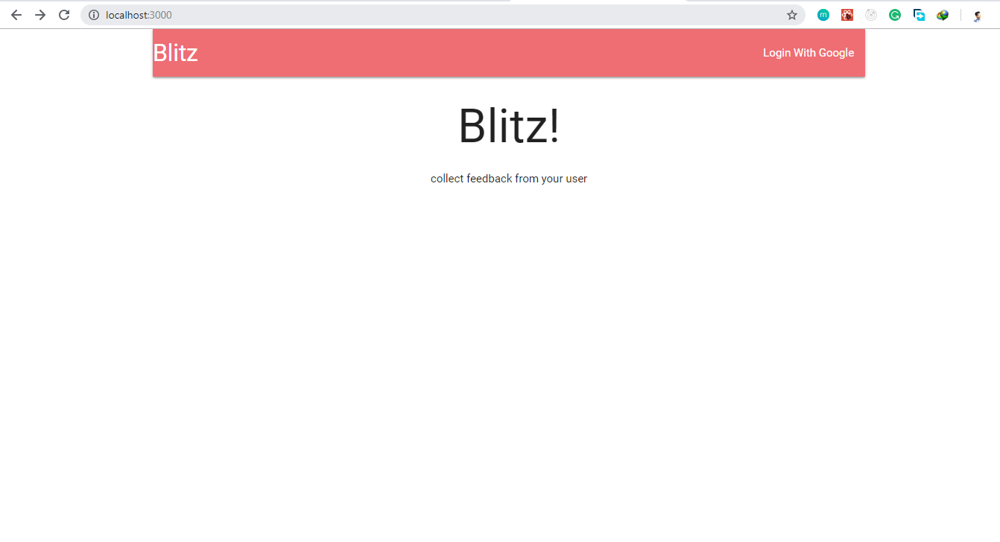
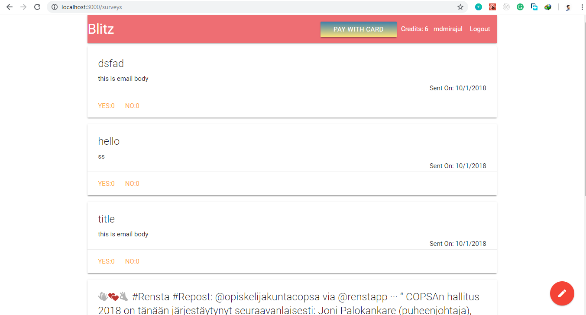
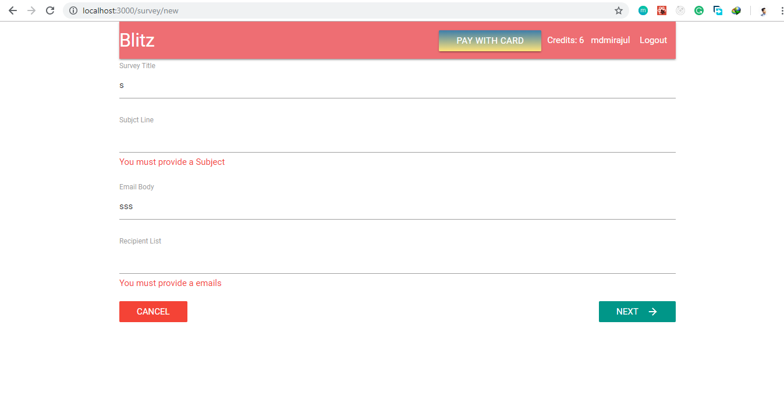
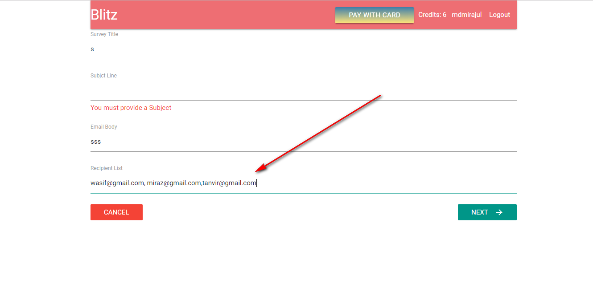
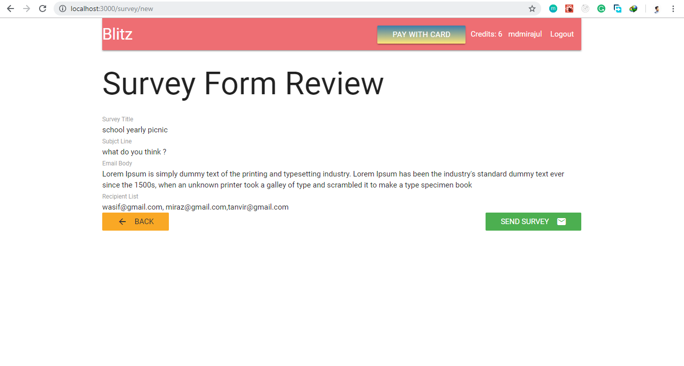
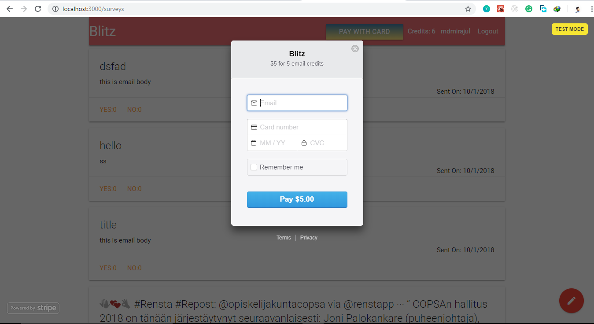
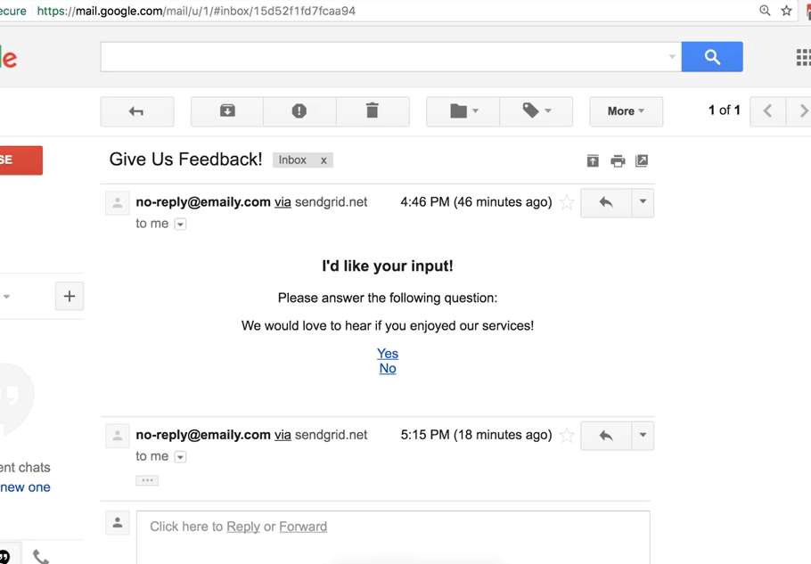
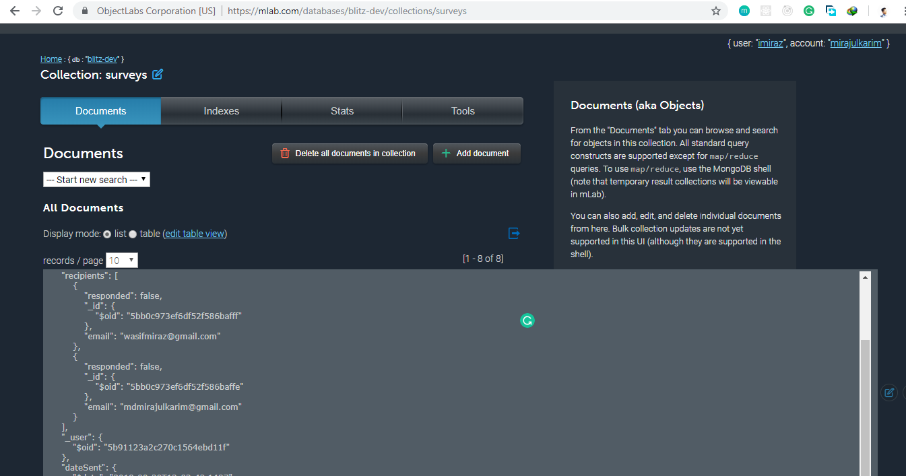
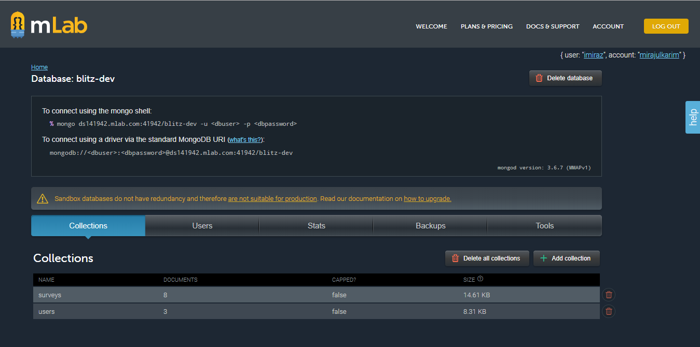

## Fullstack-Hoffyevents-react-redux

## About

 `this is  my learning based project done 90% work, I always wished I'd had a social network for event publishing to find other event publisher  to collaborate with. It's like Hoffyevent, except instead of dates it's for finding event location to city with and make tracks. View all users, view each user's profile and information,  see similar users in the sidebar. this is also can track users activity`

 

## Feature
- `Welcome landind page,`

- `After user logged in Show all survey dashboard`

- `Survey form with validation`

- `we can send at a time multiple email in one row`

- `survey review form`

- `Using stripe billing system testmode`

- `email view`

- `Mlab online based database desgin`

- `database collection`

## Following technologies are used

 - `React`
 - `Redux` 
 - `Express`
 - `mongoose`
 - `Mlab database`
 - `Nodemoon`
 - `Redux-thunk`
 - `ReduxForm`
 - `Passport js`
 - `Gooogle passport 0auth`
 - `Body-parser`
 - `NPM`
 - `Stripe`
 - `Sendgrid`
 - `Cookie-session`
 - `Concurrently`
  
 
     

## Supported Browsers

`By default, the generated project supports all modern browsers.`  
   

## Scripts

- `npm run clean` Deletes Build files of Server and Client
- `npm run build` Builds Server and Client
- `npm run start` Start server in production environment
- `npm run development` Start server in development environment

                                                                                                                                                                                                                                                                                                                                                                     